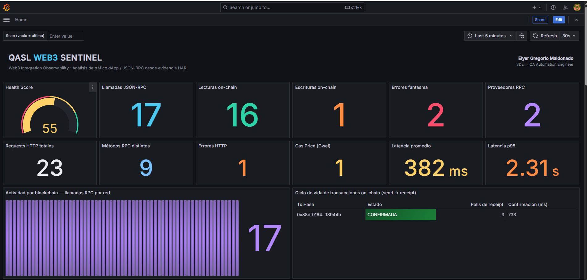
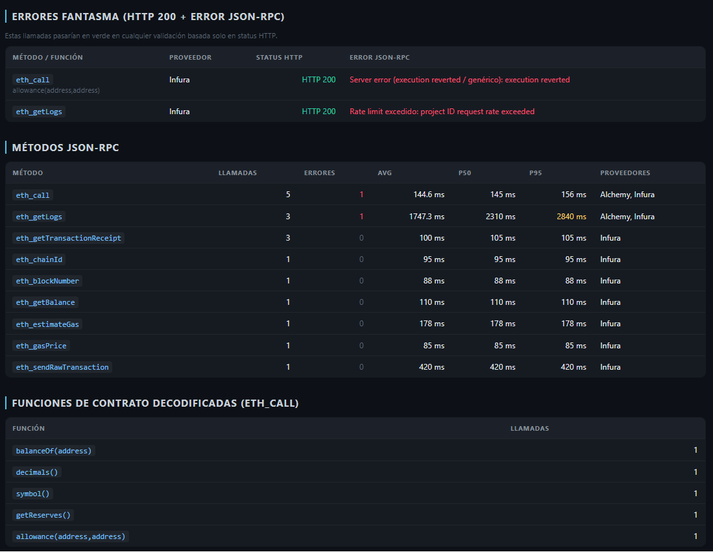
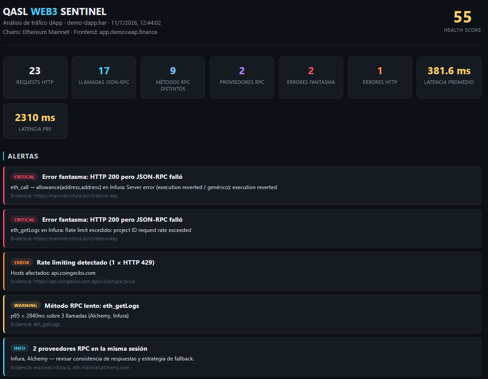
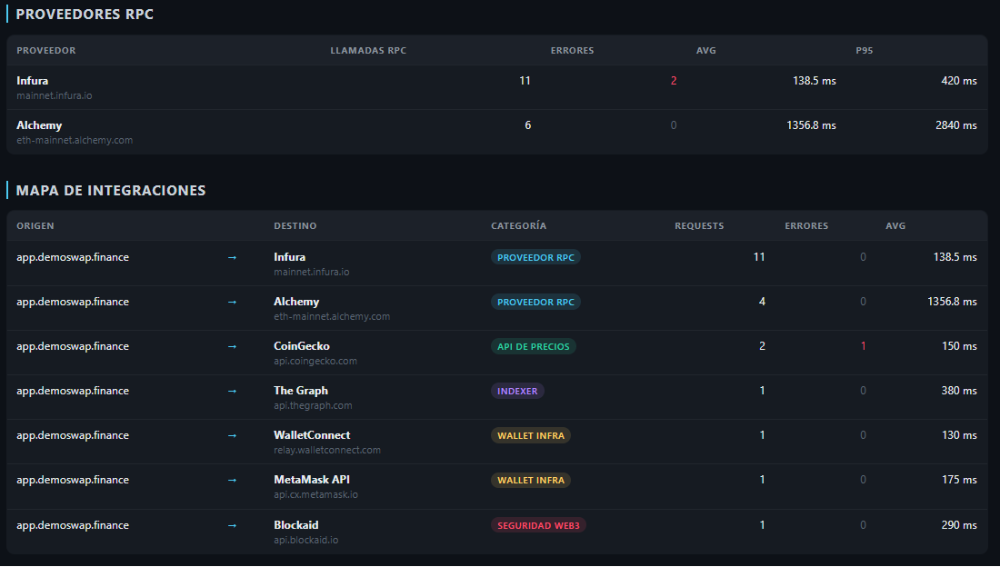
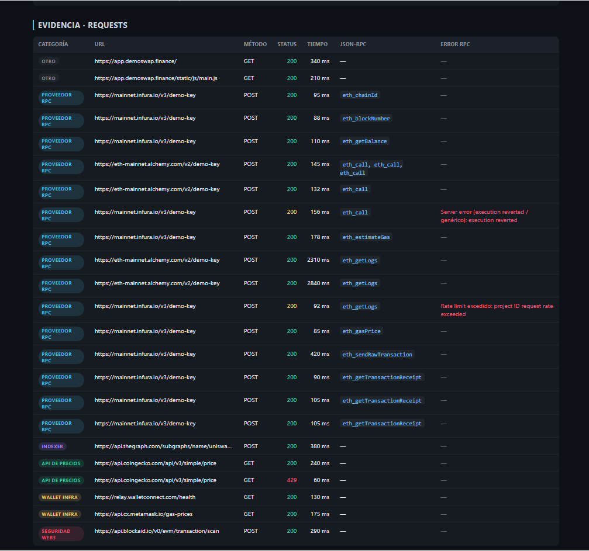
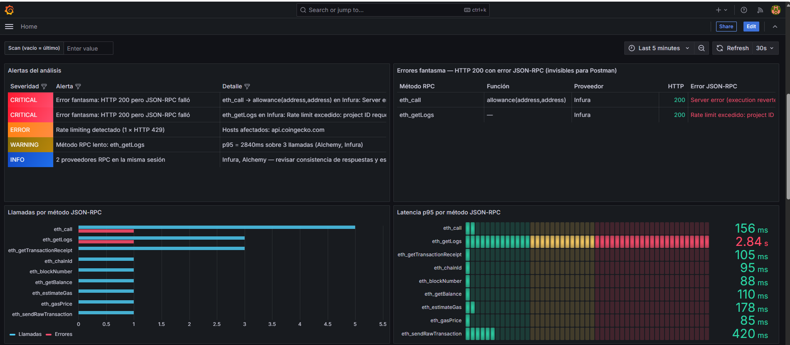
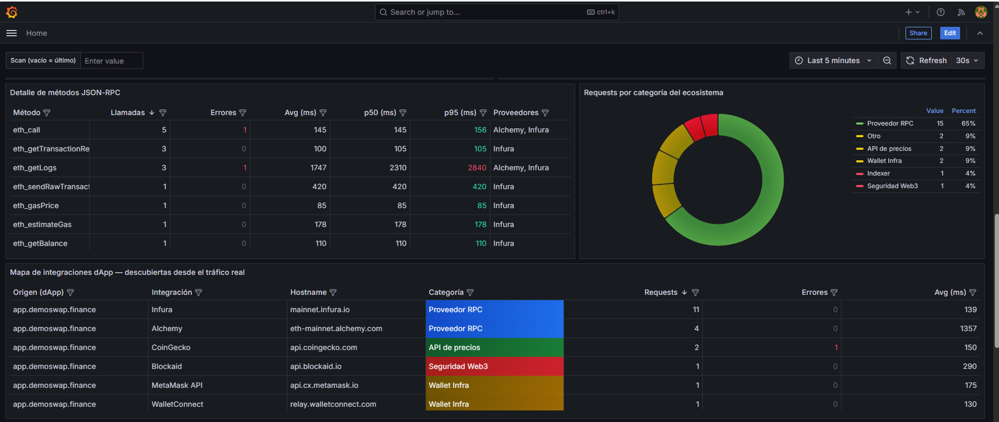
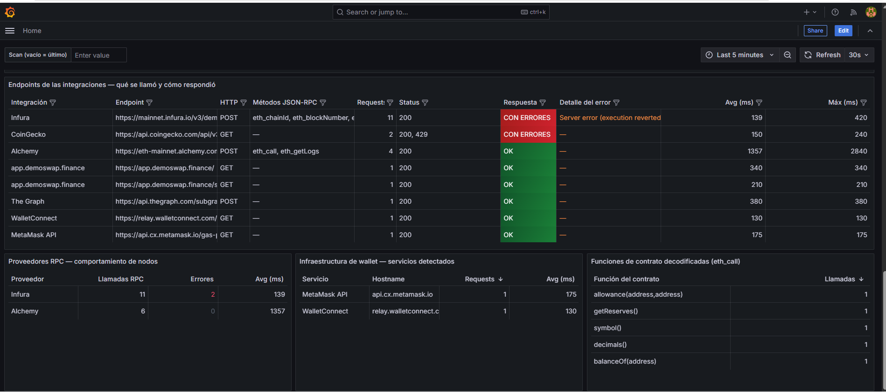

# QASL Web3 Sentinel

[](https://github.com/E-Gregorio/qasl-web3-sentinel/actions/workflows/ci.yml)


**Web3 integration observability from real traffic evidence** — detects the JSON-RPC failures that HTTP-level tools mark green.

QASL Web3 Sentinel captures a dApp session (Playwright or DevTools), opens the body of every request in the HAR, extracts the **JSON-RPC layer** (single and batch calls), and turns it into reviewable evidence: methods per provider, p50/p95 latencies, hidden errors, decoded contract calls, and the full integration map of the dApp — rendered as an executive HTML report, a JSON dataset, and a live **Grafana dashboard**.

Sister project of [QASL Backend Live Server](https://github.com/E-Gregorio/QASL-BACKEND-LIVE-SCANNER), specialized in the blockchain layer.


*The live Grafana dashboard: health score, on-chain read/write split, gas price, multi-chain RPC activity, and a real transaction lifecycle — CONFIRMED after 3 receipt polls in 733 ms.*

---

## The problem it solves

A dApp is a web application whose *backend* speaks JSON-RPC with blockchain nodes (Infura, Alchemy, QuickNode, or self-hosted gateways). Classic HTTP testing tools see that traffic as `POST 200 OK` — and stop there. But in JSON-RPC, **failures travel inside an HTTP 200**: an `execution reverted`, a `rate exceeded`, an `invalid params` all arrive with a green status code and an `error` field in the body.

Sentinel calls these **ghost errors**: failures invisible to any validation based on HTTP status. It flags them as CRITICAL, with the exact method, decoded contract function, provider, and cause.


*Ghost errors surfaced with HTTP 200 status, per-method latency stats, and decoded ERC-20 contract functions.*

| | HTTP-level tools (Postman, HAR viewers) | Node-level tools (Tenderly, Blocknative) | **QASL Web3 Sentinel** |
|---|---|---|---|
| Sees JSON-RPC methods inside traffic | ✗ | ✓ | ✓ |
| Works from *real user-side evidence* (HAR) | partially | ✗ | ✓ |
| Detects ghost errors (HTTP 200 + RPC error) | ✗ | ✓ | ✓ |
| Discovers undocumented integrations | ✗ | ✗ | ✓ |
| Zero infrastructure required to analyze | ✓ | ✗ | ✓ |

**Honest scope:** analysis is bounded by what the HAR contains (one session, one browser). Sentinel does not sign transactions or interact with the chain, and it does not replace on-chain testing with Foundry/Hardhat — it standardizes how you *read* the traffic between a dApp and its infrastructure.

---

## What it detects

| Detection | Example output |
|-----------|----------------|
| **Ghost errors** (HTTP 200 + JSON-RPC `error`) | `eth_call → allowance(...) on Infura: execution reverted` |
| Per-method RPC stats with p50/p95 latency | `eth_getLogs · 3 calls · p95 2840ms` |
| Batch JSON-RPC | calls grouped in one POST, counted individually |
| Decoded 4-byte function selectors (ERC-20/721, DEX, Multicall) | `balanceOf`, `approve`, `aggregate3 [Multicall3]` |
| Chain(s) of the session via `eth_chainId` | Ethereum, Polygon, Arbitrum, Base, testnets… |
| RPC providers — including **self-hosted gateways by body shape** | Infura, Alchemy, `Nodo RPC propio (...)` |
| dApp ecosystem map | The Graph, WalletConnect, CoinGecko, Blockaid, dApp's own backends, analytics, CDN |
| Rate limiting | HTTP 429 and JSON-RPC `-32005` |
| Health Score | 100 − severity-weighted penalties |

---

## Quick demo (10 seconds)

```bash
git clone https://github.com/E-Gregorio/qasl-web3-sentinel.git
cd qasl-web3-sentinel
npm run demo
```

Runs the engine against `input/demo-dapp.har` — a deterministic synthetic DeFi session (Infura + Alchemy, one batch, two ghost errors, a slow `eth_getLogs`, a CoinGecko 429) — and produces:

- `reports/web3-report-demo-dapp.html` — executive report (dark theme)
- `reports/web3-data-demo-dapp.json` — full dataset for dashboards / CI


*The executive HTML report: health score, KPIs, and the alert stack — two CRITICAL ghost errors caught in the demo fixture.*

<details>
<summary><strong>More report screenshots</strong> — integration map & request-level evidence</summary>


*Integration map discovered from traffic: providers, price APIs, indexer, wallet infra, and Web3 security services.*


*Request-by-request evidence: every call with its JSON-RPC method, latency, and RPC-level error detail.*

</details>

The engine itself has **zero runtime dependencies**. `npm install` downloads nothing unless you want the capture layer.

---

## Full pipeline: test → evidence → observability

```
capture-dapp.js (Playwright) / DevTools   →   input/*.har
                                                  ↓
                                              run.js
                                                  ↓
                        src/web3-parser.js   (JSON-RPC extraction, stats, alerts)
                        src/rpc-detector.js  (host/chain/selector classification)
                                                  ↓
                    reports/web3-report-*.html  ·  reports/web3-data-*.json
                                                  ↓
                        Grafana dashboard (Docker) — auto-refreshes on every scan
```

### 1. Capture — automated with Playwright

```bash
npm i -D playwright && npx playwright install chromium    # once
npm run capture:uniswap                                    # or: node capture-dapp.js <url> <name>
```

The script navigates to the dApp, runs a read-only flow (initialization, scroll, a 20s manual-interaction window), streams every JSON-RPC call to the console live, and records the HAR with embedded bodies (`recordHar` + `content: 'embed'`).

### 1b. Wallet flows — real MetaMask automation (Dappwright)

```bash
npm i -D @tenkeylabs/dappwright     # once — downloads the real MetaMask extension
npm run capture:wallet              # or: node capture-wallet-dapp.js <url> <name>
```

Launches Chromium with the **real MetaMask extension**, imports a disposable test wallet (the public Hardhat seed — no funds, never use a personal seed), navigates to the dApp, auto-connects the wallet (`Connect → MetaMask → Approve`, with a manual fallback window), and records the whole session through the project's own **HAR recorder** (`src/har-recorder.js`) — built because extension-based contexts don't expose Playwright's native `recordHar`. The engine then analyzes the wallet-connected session like any other: address-bound balance queries, connection side effects, and every JSON-RPC call the dApp fires once a wallet is present.

Manual alternative: Chrome DevTools → Network → *Preserve log* → run the flow → *Save all as HAR with content* → drop it in `input/`.

### 2. Analyze

```bash
node run.js my-session.har
```

### 3. Observe — Grafana dashboard

```bash
npm run grafana        # Docker: Grafana OSS + the project's data API
```

| Service | Default host port |
|---------|-------------------|
| Grafana | **48147** |
| Data API | **48291** |

Open **http://localhost:48147** (default credentials `qasl` / `qaslweb32026` — change them in `grafana/.env`, see `.env.example`).

The dashboard is provisioned automatically and is **fully dynamic**: the API (native Node HTTP, zero deps) always serves the latest scan from `reports/`, refreshed every 30s. Run a new scan and the dashboard re-renders itself — nothing hardcoded. Panels include Health Score, JSON-RPC KPIs, severity-colored alerts, **ghost errors**, per-method call volume and p95 latency, ecosystem category distribution, RPC node behavior, decoded contract functions, the **integration map**, per-endpoint response detail, and request-by-request evidence.


*Severity-ranked alerts and the ghost-error panel: two failures with HTTP 200 that any status-based check would mark green — flagged CRITICAL with method, decoded function, provider and cause.*


*Per-method stats with threshold-colored p95, request distribution across the ecosystem, and the integration map discovered from real traffic.*

<details>
<summary><strong>More dashboard screenshots</strong> — endpoint responses, node behavior & wallet infrastructure</summary>


*Per-endpoint response detail (including a JSON-RPC failure hiding behind HTTP 200), RPC node behavior, detected wallet-infrastructure services, and decoded ERC-20 contract functions.*

</details>

The API also runs without Docker (`npm run grafana:api`, port 7392) and exposes: `/api/meta`, `/api/methods`, `/api/providers`, `/api/integrations`, `/api/endpoints`, `/api/alerts`, `/api/ghost-errors`, `/api/selectors`, `/api/categories`, `/api/requests`, `/api/sources` — all accept `?source=<file>` to query a specific scan.

---

## Live demo runbook (from zero)

Everything needed to run the full end-to-end demo on a clean machine, in order.

**One-time setup:**

```powershell
git clone https://github.com/E-Gregorio/qasl-web3-sentinel.git
cd qasl-web3-sentinel
npm i -D playwright @tenkeylabs/dappwright
npx playwright install chromium
```

**The demo, step by step:**

```powershell
# 1. Open Docker Desktop and wait until it says "running"

# 2. Baseline analysis — deterministic fixture with ghost errors and a confirmed transaction
npm run demo

# 3. Start the observability stack (Grafana + data API)
npm run grafana
#    → open http://localhost:48147  (user: qasl / password: qaslweb32026)
#    The dashboard loads as home, fed by the scan from step 2:
#    2 CRITICAL ghost errors, on-chain write, tx CONFIRMED in 733 ms.

# 4. LIVE: automated wallet flow — Chromium opens with the real MetaMask extension,
#    imports a disposable test wallet and auto-connects to Uniswap
npm run capture:wallet

# 5. Analyze the session you just captured
node run.js wallet-session.har

# 6. Back to Grafana → F5. The whole dashboard re-renders with the live session:
#    ~600 requests, multi-chain activity (Ethereum, Linea, Base, Arbitrum, BSC,
#    Optimism, Polygon, Sepolia...), MetaMask's own microservices, zero config.

# 7. Flip between scans with the "Scan" variable at the top:
#    web3-data-demo-dapp.json   → fixture with ghost errors + tx lifecycle
#    (empty)                    → latest scan
```

**Pre-demo checklist:** Docker Desktop already running · stack already up (`npm run grafana`) · `npm run demo` already executed · MetaMask already downloaded by a previous `capture:wallet` run · stable internet · browser tabs ready: Grafana (48147), the GitHub repo, and the Actions tab with the green pipeline.

---

## CI/CD

Two GitHub Actions workflows ship with the repo:

**`ci.yml` — engine self-test (every push).** Runs the engine against the deterministic demo fixture and then executes `scripts/verify-engine.js`: a regression gate with 14 assertions (ghost errors found and decoded, batch extraction, chain detection, alert generation, health score…). If the engine's behavior drifts, the build goes red. The HTML report and JSON dataset are uploaded as build artifacts on every run.

**`live-capture.yml` — live production capture (manual).** On demand, spins up headless Playwright inside the runner, captures real traffic from any dApp URL you pass as input, analyzes it, and publishes the reports as artifacts. Deliberately manual: live capture depends on external networks and must never gate the main CI.

---

## Case study: Uniswap (production traffic)

First run against `app.uniswap.org` — no configuration, findings straight from the evidence:

- **Uniswap does not expose Infura/Alchemy**: it proxies all RPC through its own gateway (`entry-gateway.backend-prod.api.uniswap.org`). Sentinel classified it as a self-hosted RPC node **by the shape of the JSON-RPC bodies**, not by any domain list.
- That gateway returned **7 × HTTP 401** on `/rpc/1` during the session — undocumented behavior surfaced on the first scan.
- **Multicall3 in action**: the session's `eth_call`s decoded to `aggregate3(...)` — Uniswap batches dozens of on-chain reads into single calls.
- The integration map exposed 5 internal backends (including `privy.app.uniswap.org`, its embedded-wallet auth), CoinGecko across 3 subdomains grouped as one integration, WalletConnect, and its real-time price WebSocket stream.
- Polling profile: 11 × `eth_blockNumber` / 9 × `eth_chainId` with p95 865ms — the heartbeat behind live price updates.

---

## Sensitive data

A Web3 session HAR may contain provider API keys in URLs (`/v3/<key>`), wallet addresses, and transaction payloads. Treat HARs as secrets: `.gitignore` already excludes `input/*.har` (except the synthetic demo). Reports contain aggregated evidence only.

---

## npm scripts

| Script | Description |
|--------|-------------|
| `npm run demo` | Analyze the bundled demo fixture |
| `npm run scan` / `npm start` | `node run.js` (first `.har` in `input/` if no file given) |
| `npm run capture` | Capture a dApp session with Playwright (Uniswap by default) |
| `npm run capture:uniswap` | Capture Uniswap → `input/uniswap-session.har` |
| `npm run capture:wallet` | Automated MetaMask wallet flow (Dappwright) → `input/wallet-session.har` |
| `npm run grafana` / `grafana:down` | Start / stop the Grafana + API Docker stack |
| `npm run grafana:api` | Data API only, no Docker (port 7392) |

---

## Roadmap

- [x] Real MetaMask wallet automation via Dappwright + custom HAR recorder
- [x] Multi-chain activity attribution (provider hostnames + `eth_chainId`)
- [x] On-chain read/write split, gas price extraction, transaction lifecycle (send → receipt polls → confirmation)
- [ ] AI-assisted analysis: Claude API chat over scan reports, embedded in the dashboard
- [ ] Quality gates: `--fail-on-ghost` / latency thresholds as exit codes for CI
- [ ] Playwright Test fixture + reporter: attach Sentinel analysis to the native Playwright HTML report
- [ ] Scan diff: detect new integrations / regressions between sessions
- [ ] Full calldata decoding with ABIs (beyond 4-byte selectors)
- [ ] WebSocket RPC support (`eth_subscribe`)

---

## Author

**Elyer Gregorio Maldonado** — SDET · QA Automation Engineer · 2026

*QASL Web3 Sentinel is part of the QASL tooling suite.*
